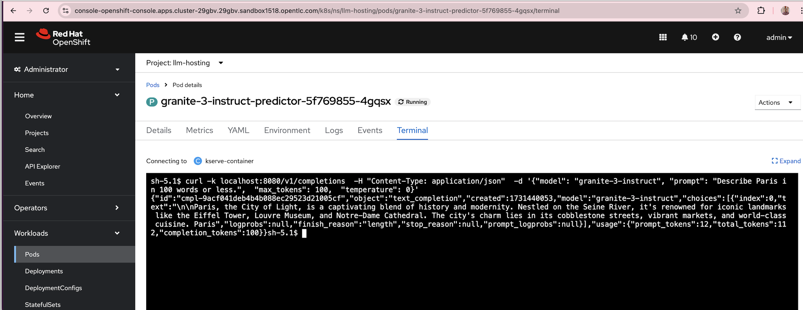

# granite3-rhoai
# Running granite 3 models on Red Hat OpenShift AI(RHOAI)

This guide provides instructions for a quick way of running granite 3 models on OpenShift AI.<br/>

##  Steps

1. Have a running OCP cluster.

2. From Operator hub, install Node Feature Discovery operator. Then create an instance of Node feature discovery<br/>
3. Then, from Operator hub, install NVIDIA GPU Operator. Then create an instance of Cluster Policy<br/>
4. From Operator hub, install Serverless Operator and ServiceMesh 2.x Operator. Dont create any instances<br/>
5. From Operator hub, install Red Hat OpenShift AI operator.<br/>
6. Install minio for s3 storage using https://medium.com/accelerating-ai-innovation-simplifying-ml/accelerating-ai-innovation-simplifying-ml-pipelines-and-inference-with-openshift-ai-9fb2fb32f860 <br/>
7. Install ODH-tech using quay.io/rh-aiservices-bu/odh-tec:latest  <br/>
    https://github.com/opendatahub-io-contrib/odh-tec/tree/main  <br/>
8. Import  model ibm-granite/granite-3.0-2b-instruct using  https://github.com/rh-aiservices-bu/models-aas/tree/main?tab=readme-ov-file    <br/>
9. Start a g5.xlarge node <br/>

   configure taints/tolerations <br/>
   https://github.com/redhat-na-ssa/hobbyist-guide-to-rhoai/blob/main/docs/05-configure-gpu-sharing-method.md#52-configure-taints-and-tolerations <br/>

   ```
   oc adm taint node ip-10-0-5-51.us-east-2.compute.internal -l nvidia.com/gpu.machine nvidia.com/gpu=:NoSchedule --overwrite
   oc patch clusterpolicy gpu-cluster-policy --type=merge --patch '{"spec":{"daemonsets":{"tolerations":[{"effect":"NoSchedule","operator":"Exists","key":"nvidia.com/gpu"}]}}}'

10. configure RHOAI accelerator profile <br/>
    https://github.com/redhat-na-ssa/hobbyist-guide-to-rhoai/blob/main/docs/08-configure-rhoai.md <br/>

11. Create ServingRuntime and InferenceService on RHOAI
    https://github.com/rh-aiservices-bu/models-aas/blob/main/deployment/model_serving/granite-code-vllm-raw.yaml has some examples <br/>
    <br/> [Sample granite 3 vllm file ](sample-granite3-vllm.yml)

13. Test the granite model using curl command

    

    ```
    curl -k localhost:8080/v1/completions  -H "Content-Type: application/json"  -d '{"model": "granite-3-instruct", "prompt": "Describe Paris in 100 words or less.",  "max_tokens": 100,  "temperature": 0}' <br/>

    
14. Troubleshooting <br/>
    If you run into errors like the below, use a newer vllm image
    ```
    ValueError: Model architectures ['GraniteForCausalLM'] are not supported for now
    
